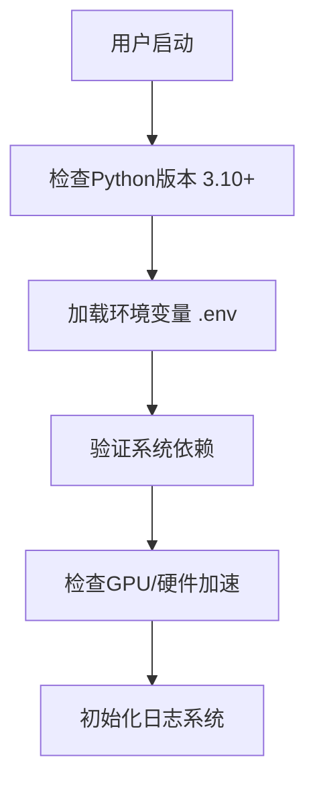
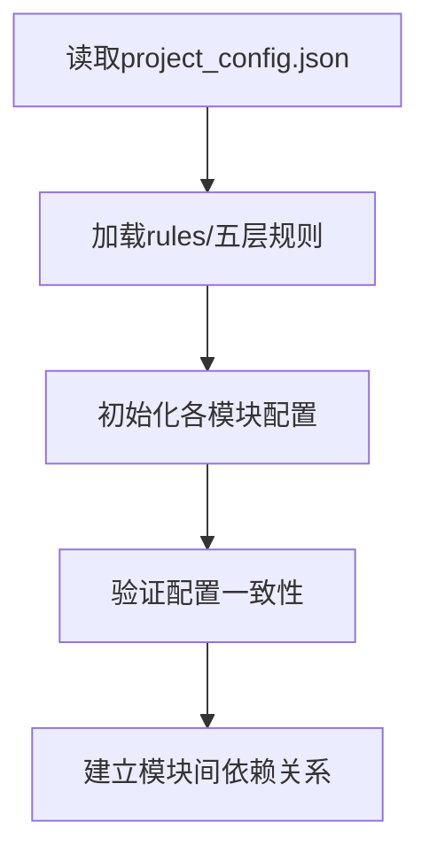
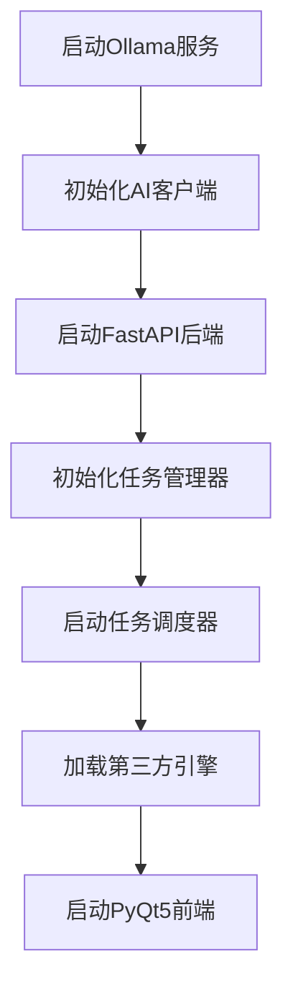
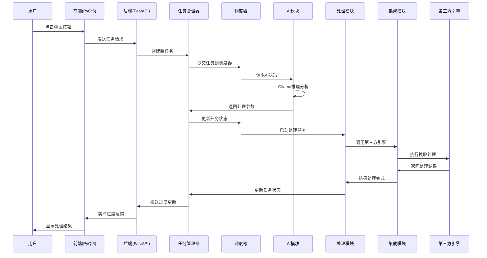
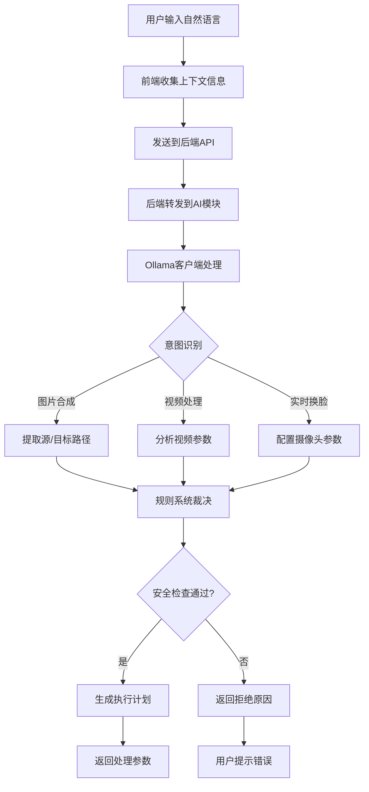
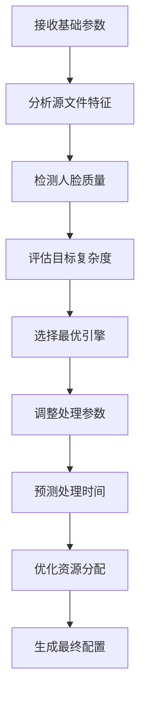
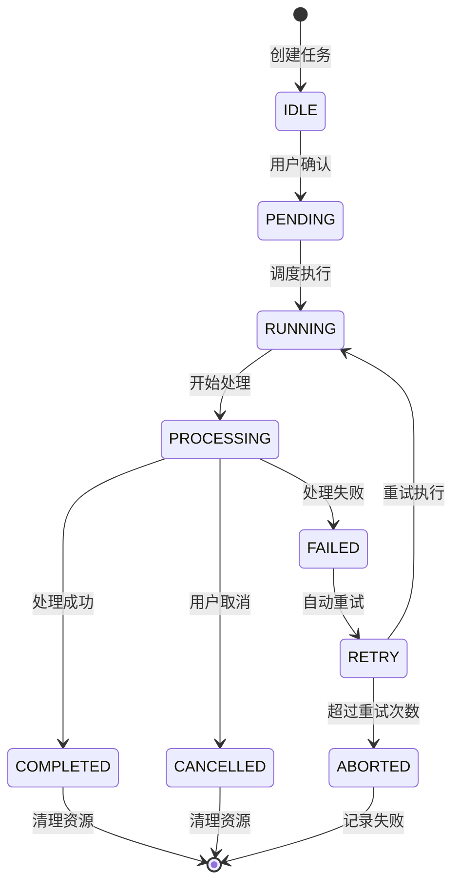
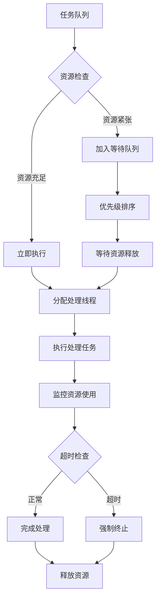
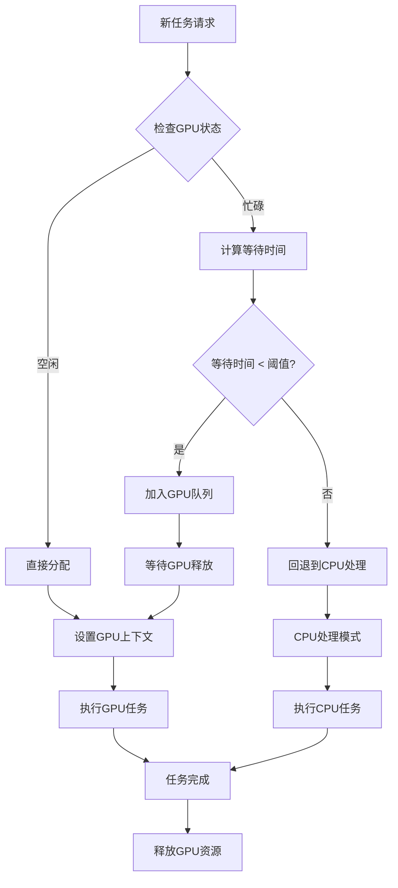
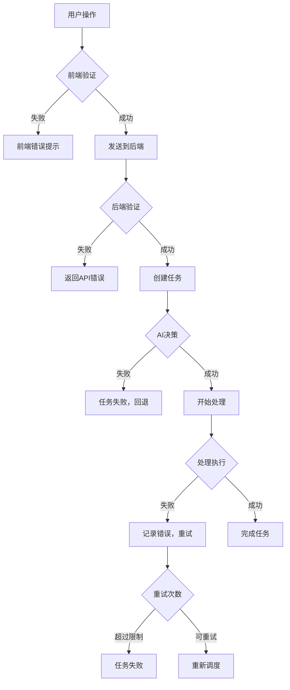

# 🏗️ 项目架构说明

## 📊 项目架构总览

### 分层架构图
```
┌─────────────────────────────────────────────────────────────┐
│                    Presentation Layer                       │
│  ┌─────────────────┐  ┌─────────────────┐  ┌─────────────┐  │
│  │   Main Window   │  │   Popup Window  │  │  Components │  │
│  │   (PyQt5 GUI)   │  │   (AI Entry)    │  │   (UI Parts) │  │
│  └─────────────────┘  └─────────────────┘  └─────────────┘  │
└─────────────────────────────────────────────────────────────┘
                                │
┌─────────────────────────────────────────────────────────────┐
│                   Application Layer                         │
│  ┌─────────────────┐  ┌─────────────────┐  ┌─────────────┐  │
│  │  Task Manager   │  │    Scheduler    │  │ API Server  │  │
│  │ (任务管理/状态) │  │  (任务调度)     │  │ (REST API)  │  │
│  └─────────────────┘  └─────────────────┘  └─────────────┘  │
└─────────────────────────────────────────────────────────────┘
                                │
┌─────────────────────────────────────────────────────────────┐
│                     Domain Layer                            │
│  ┌─────────────────┐  ┌─────────────────┐                   │
│  │   AI Module     │  │ Processing Mod  │                   │
│  │ (Ollama推理)    │  │ (媒体处理)      │                   │
│  └─────────────────┘  └─────────────────┘                   │
└─────────────────────────────────────────────────────────────┘
                                │
┌─────────────────────────────────────────────────────────────┐
│                  Infrastructure Layer                       │
│  ┌─────────────────┐  ┌─────────────────┐  ┌─────────────┐  │
│  │  Integrations   │  │    Utils       │  │   Config    │  │
│  │ (第三方引擎)    │  │  (工具函数)    │  │ (配置管理)  │  │
│  └─────────────────┘  └─────────────────┘  └─────────────┘  │
└─────────────────────────────────────────────────────────────┘
```

## 📁 目录结构详解

### 根目录结构
```
my_ai_popup_project/
├── 📁 assets/              # 资源和第三方项目
│   ├── 📁 Deep-Live-Cam-main/    # 实时换脸引擎
│   ├── 📁 facefusion-master/     # 高质量视频换脸
│   ├── 📁 iRoopDeepFaceCam-main/ # 表情/姿态换脸
│   ├── 📁 images/                # 图片资源
│   ├── 📁 videos/                # 视频资源
│   ├── 📁 models/                # AI模型
│   └── assets_config.json        # 资源配置
├── 📁 docs/                # 项目文档
│   ├── 📁 project_docs/          # 项目文档
│   ├── 📁 deployment_progress/   # 部署进度
│   ├── docs_config.json          # 文档配置
│   └── docs_README.md            # 文档说明
├── 📁 rules/               # 规则系统
│   ├── L1-meta-goal.json         # 元目标层
│   ├── L2-understanding.json     # 全局理解层
│   ├── L3-constraints.json       # 约束层
│   ├── L4-decisions.json         # 决策层
│   ├── L5-execution.json         # 执行层
│   ├── rules.config.js           # 规则配置
│   └── 📁 data/                  # 规则数据
├── 📁 src/                 # 源代码
│   ├── 📁 ai/                     # AI模块
│   ├── 📁 backend/                # 后端服务
│   ├── 📁 config/                 # 配置模块
│   ├── 📁 frontend/               # 前端UI
│   ├── 📁 integrations/           # 集成模块
│   ├── 📁 processing/             # 处理模块
│   ├── 📁 utils/                  # 工具模块
│   ├── entry.py                   # 入口脚本
│   ├── main.py                    # 主入口
│   ├── src_config.json            # 源码配置
│   └── src_config_refactor.json   # 重构配置
├── 📁 tests/               # 测试代码
├── 📁 logs/                # 日志文件
├── 📁 health_monitor/      # 健康监控脚本
├── project_config.json     # 项目配置
├── requirements.txt        # Python依赖
├── start.sh                # 启动脚本
├── TODO.md                 # 任务跟踪
├── README.md               # 项目说明
└── verify_paths.py         # 路径验证
```

### 模块详细结构

#### 🎨 前端模块 (src/frontend/)
```
frontend/
├── __init__.py
├── main_window.py          # 主窗口
├── popup_window.py         # 弹窗窗口
├── components/             # UI组件
│   ├── video_panel.py      # 视频面板
│   ├── image_panel.py      # 图片面板
│   ├── progress_bar.py     # 进度条
│   └── control_buttons.py  # 控制按钮
├── styles/                 # 样式文件
└── frontend_config.json    # 前端配置
```

#### 🔧 后端模块 (src/backend/)
```
backend/
├── __init__.py
├── api_server.py          # API服务器
├── task_manager.py         # 任务管理器
├── scheduler.py            # 任务调度器
├── middleware/             # 中间件
│   ├── logging_middleware.py    # 日志中间件
│   └── auth_middleware.py       # 认证中间件
└── backend_config.json     # 后端配置
```

#### 🤖 AI模块 (src/ai/)
```
ai/
├── __init__.py
├── ollama_client.py        # Ollama客户端
├── analyzers/              # 分析器
├── face_recognition/       # 人脸识别
├── processors/             # 处理器
└── ai_config.json          # AI配置
```

#### ⚙️ 处理模块 (src/processing/)
```
processing/
├── __init__.py
├── video_processor.py      # 视频处理器
├── image_processor.py      # 图片处理器
├── realtime_processor.py   # 实时处理器
├── batch_processor.py      # 批量处理器
└── processing_config.json  # 处理配置
```

#### 🔗 集成模块 (src/integrations/)
```
integrations/
├── __init__.py
├── deep_live_cam.py        # Deep-Live-Cam集成
├── facefusion.py           # FaceFusion集成
├── iroop_deepfacecam.py    # iRoop集成
└── integrations_config.json # 集成配置
```

#### 🛠️ 工具模块 (src/utils/)
```
utils/
├── __init__.py
├── file_utils.py           # 文件工具
├── video_utils.py          # 视频工具
├── image_utils.py          # 图片工具
├── thread_utils.py         # 线程工具
├── logger.py               # 日志工具
├── path_resolver.py        # 路径解析
└── utils_config.json       # 工具配置
```

#### ⚙️ 配置模块 (src/config/)
```
config/
├── __init__.py
├── app_config.py           # 应用配置
└── config_config.json      # 配置管理配置
```

## 🔄 数据流向图

### 用户操作到结果输出的完整流程
```
用户输入
    ↓
前端UI (PyQt5)
    ↓ (API调用)
后端API (FastAPI)
    ↓ (任务创建)
任务管理器 (TaskManager)
    ↓ (任务调度)
调度器 (Scheduler)
    ↓ (AI决策)
AI模块 (Ollama推理)
    ↓ (参数优化)
处理模块 (Processing)
    ↓ (引擎调用)
集成模块 (Integrations)
    ↓ (第三方引擎)
Deep-Live-Cam / FaceFusion / iRoop
    ↓ (结果返回)
处理模块 (结果处理)
    ↓ (状态更新)
任务管理器 (状态更新)
    ↓ (进度推送)
前端UI (实时更新)
    ↓
用户看到结果
```

## 📋 模块职责矩阵

| 模块 | 用户界面 | 业务逻辑 | 数据处理 | 外部集成 | 配置管理 | 日志监控 |
|------|----------|----------|----------|----------|----------|----------|
| frontend | ✅ 主负责 | ❌ | ❌ | ❌ | ❌ | ❌ |
| backend | ❌ | ✅ 主负责 | ✅ 辅助 | ❌ | ✅ 辅助 | ✅ 辅助 |
| ai | ❌ | ✅ 主负责 | ✅ 主负责 | ❌ | ✅ 辅助 | ❌ |
| processing | ❌ | ✅ 辅助 | ✅ 主负责 | ✅ 辅助 | ❌ | ❌ |
| integrations | ❌ | ❌ | ❌ | ✅ 主负责 | ❌ | ✅ 辅助 |
| utils | ❌ | ❌ | ✅ 辅助 | ❌ | ❌ | ✅ 主负责 |
| config | ❌ | ❌ | ❌ | ❌ | ✅ 主负责 | ❌ |

## 🔗 依赖关系图

### 模块依赖关系
```
config (基础设施)
├── utils (基础设施)
│   ├── integrations (基础设施)
│   │   ├── processing (领域)
│   │   │   ├── ai (领域)
│   │   │   │   ├── backend (应用)
│   │   │   │   │   └── frontend (表现)
│   │   └── ai (领域)
│   └── ai (领域)
└── frontend (表现)
```

### 技术栈依赖
- **Python 3.10+**: 核心运行环境
- **PyQt5**: 桌面GUI框架
- **FastAPI**: Web框架和API
- **Ollama**: 本地AI推理
- **OpenCV/Pillow**: 图像视频处理
- **Torch**: 深度学习框架
- **第三方引擎**: Deep-Live-Cam, FaceFusion, iRoop

## 🚀 部署架构

### 单机部署架构
```
┌─────────────────────────────────────────────────────────────┐
│                    用户桌面环境                             │
│  ┌─────────────────────────────────────────────────────┐    │
│  │                AI弹窗应用                           │    │
│  │  ┌─────────────┐  ┌─────────────┐  ┌─────────────┐  │    │
│  │  │   Frontend  │  │   Backend   │  │   AI Core   │  │    │
│  │  │   (PyQt5)   │  │  (FastAPI)  │  │  (Ollama)   │  │    │
│  │  └─────────────┘  └─────────────┘  └─────────────┘  │    │
│  └─────────────────────────────────────────────────────┘    │
│                                                            │
│  ┌─────────────────────────────────────────────────────┐    │
│  │              第三方引擎集成                          │    │
│  │  ┌─────────────┐  ┌─────────────┐  ┌─────────────┐  │    │
│  │  │ Deep-Live- │  │  FaceFusion │  │    iRoop    │  │    │
│  │  │    Cam     │  │             │  │             │  │    │
│  │  └─────────────┘  └─────────────┘  └─────────────┘  │    │
│  └─────────────────────────────────────────────────────┘    │
└─────────────────────────────────────────────────────────────┘
```

### 资源管理架构
- **本地优先**: 所有数据处理在本地完成
- **GPU加速**: 支持CUDA/DirectML/OpenCL
- **内存管理**: 智能缓存和垃圾回收
- **存储优化**: 压缩存储和自动清理

## 🚀 项目启动流程

### 1️⃣ 环境初始化阶段


### 2️⃣ 配置加载阶段


### 3️⃣ 服务启动阶段


## 🔄 运行时序图

### 完整用户操作流程


## 🤖 AI执行逻辑

### AI决策流程


### AI参数优化逻辑


## 📊 任务状态机

### 任务生命周期


### 状态转换规则
- **IDLE → PENDING**: 用户确认任务参数
- **PENDING → RUNNING**: 调度器分配资源
- **RUNNING → PROCESSING**: AI决策完成，开始实际处理
- **PROCESSING → COMPLETED**: 处理成功，生成输出文件
- **PROCESSING → FAILED**: 处理过程中出现错误
- **FAILED → RETRY**: 自动重试（最多3次）
- **RETRY → ABORTED**: 重试失败，任务终止

## 🔄 模块间交互协议

### 前端 ↔ 后端通信
```json
// 请求格式
{
    "taskType": "image_to_camera",
    "sourcePath": "/path/to/source.jpg",
    "parameters": {
        "quality": "high",
        "fps": 25
    },
    "priority": "normal"
}

// 响应格式
{
    "success": true,
    "data": {},
    "message": "操作成功",
    "timestamp": "2024-01-01T00:00:00Z",
    "requestId": "req-123456"
}
```

### 实时进度推送 (WebSocket)
```json
// 进度更新
{
    "type": "progress",
    "taskId": "task_123456",
    "progress": 45,
    "message": "正在处理第3帧...",
    "eta": 15
}

// 状态变更
{
    "type": "status",
    "taskId": "task_123456",
    "status": "processing",
    "timestamp": 1640995200
}

// 完成通知
{
    "type": "completed",
    "taskId": "task_123456",
    "resultPath": "/output/result.mp4",
    "processingTime": 28.5
}
```

### AI决策协议
```json
// AI分析请求
{
    "command": "把我的照片换到这个视频里",
    "context": {
        "sourceType": "image",
        "targetType": "video",
        "files": {
            "source": "/path/to/photo.jpg",
            "target": "/path/to/video.mp4"
        }
    }
}

// AI决策响应
{
    "intent": "face_swap_video",
    "parameters": {
        "taskType": "image_to_video",
        "engine": "facefusion",
        "quality": "high",
        "blendMode": "poisson"
    },
    "estimatedTime": 120
}
```

## ⚡ 性能优化策略

### 并发处理机制


### 内存管理策略
- **预分配策略**: 启动时预分配GPU内存
- **动态调整**: 根据任务复杂度调整内存使用
- **垃圾回收**: 处理完成后立即释放资源
- **缓存机制**: 复用已加载的模型和数据

### GPU资源调度


## 🛡️ 错误处理和恢复

### 分层错误处理


### 自动恢复机制
- **网络重连**: Ollama服务断开自动重连
- **GPU恢复**: GPU内存不足时自动清理并重试
- **文件恢复**: 处理中断时从断点继续
- **状态同步**: 多进程间状态自动同步

## 📈 监控和日志

### 性能指标收集
- **处理时间**: 各阶段耗时统计
- **资源使用**: CPU/GPU/内存使用率
- **成功率**: 任务成功/失败比例
- **用户体验**: 响应时间和等待时间

### 日志分层
- **DEBUG**: 详细的调试信息
- **INFO**: 重要的状态变更
- **WARNING**: 潜在问题警告
- **ERROR**: 错误和异常信息
- **CRITICAL**: 严重错误，需要立即处理

---

*本文档由自动化系统维护，最后更新: 2026-01-16*
