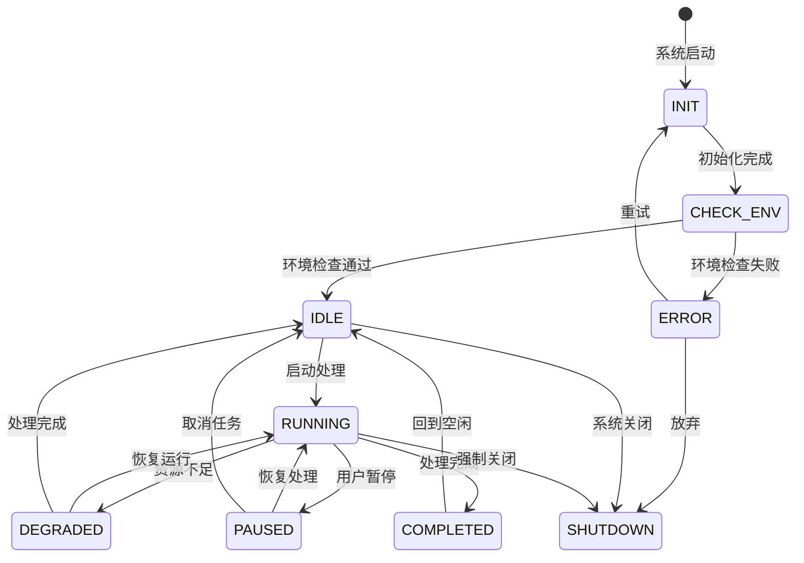

# 整体项目逻辑

> AISP 项目整体架构与数据流说明
> 
> 文档版本: 1.0.0
> 最后更新: 2025-01-21

---

## 一、项目概述

### 1.1 项目定位

**AISP (AI Swap Platform)** 是一个完全离线的本地AR合成系统，以人脸与场景为核心，通过统一AI策略层调度多种本地模型与引擎，实现图片/视频/实时摄像头之间的智能识别、合成与输出。

### 1.2 核心特性

- 🎭 **多引擎支持**: Deep-Live-Cam、FaceFusion、iRoop无缝集成
- 📹 **实时处理**: 支持摄像头实时换脸与特效处理
- 🤖 **本地AI策略**: 使用Ollama/LLaMA 3.2生成智能优化策略
- 🎥 **虚拟摄像头**: 输出到任意支持虚拟摄像头的应用
- 🎛 **OBS联动**: 自动场景切换与输出控制
- 🖥 **图形界面**: PyQt6现代化桌面界面
- 🔌 **REST API**: FastAPI完整API接口

---

## 二、系统架构

### 2.1 整体架构图

```
┌─────────────────────────────────────────────────────────────────┐
│                         用户层                                   │
│  ┌───────────────────┐    ┌───────────────────────────────────┐ │
│  │      GUI          │    │           Web Frontend            │ │
│  │   (PyQt6)         │    │     (Vue.js + ECharts)           │ │
│  └─────────┬─────────┘    └───────────────────────────────────┘ │
└───────────┼─────────────────────────────────────────────────────┘
            │
            ▼
┌─────────────────────────────────────────────────────────────────┐
│                     API网关层                                    │
│  ┌───────────────────────────────────────────────────────────┐  │
│  │                  backend/unified_api.py                   │  │
│  │                  backend/api.py (废弃)                    │  │
│  └───────────────────────────────────────────────────────────┘  │
└─────────────────────────┬───────────────────────────────────────┘
                          │
                          ▼
┌─────────────────────────────────────────────────────────────────┐
│                     业务服务层                                    │
│  ┌───────────────────────────────────────────────────────────┐  │
│  │                     backend/services/                     │  │
│  │  ┌─────────────┐ ┌─────────────┐ ┌─────────────────────┐ │  │
│  │  │  视频处理   │ │  人脸服务   │ │      任务调度       │ │  │
│  │  │video_pipeline│ │face_*      │ │task_scheduler      │ │  │
│  │  └─────────────┘ └─────────────┘ └─────────────────────┘ │  │
│  └───────────────────────────────────────────────────────────┘  │
│                                                                  │
│  ┌───────────────────────────────────────────────────────────┐  │
│  │                     backend/ai_control/                   │  │
│  │  ┌─────────────┐ ┌─────────────┐ ┌─────────────────────┐ │  │
│  │  │  自动策略   │ │  Ollama客户端│ │      内存数据库     │ │  │
│  │  │auto_strategy│ │ollama_client│ │memory_db           │ │  │
│  │  └─────────────┘ └─────────────┘ └─────────────────────┘ │  │
│  └───────────────────────────────────────────────────────────┘  │
└─────────────────────────┬───────────────────────────────────────┘
                          │
                          ▼
┌─────────────────────────────────────────────────────────────────┐
│                     AR引擎层                                      │
│  ┌───────────────────────────────────────────────────────────┐  │
│  │                backend/ar_engine/                         │  │
│  │  ┌─────────────┐ ┌─────────────┐ ┌─────────────────────┐ │  │
│  │  │frame_pipeline│ │  adapters/  │ │      tracker/       │ │  │
│  │  └─────────────┘ └─────────────┘ └─────────────────────┘ │  │
│  └───────────────────────────────────────────────────────────┘  │
└─────────────────────────┬───────────────────────────────────────┘
                          │
                          ▼
┌─────────────────────────────────────────────────────────────────┐
│                     引擎底层                                      │
│  ┌─────────────┐ ┌─────────────┐ ┌───────────────────────────┐  │
│  │ Deep-Live-  │ │ FaceFusion  │ │        iRoop              │  │
│  │    Cam      │ │             │ │                          │  │
│  └─────────────┘ └─────────────┘ └───────────────────────────┘  │
└─────────────────────────┬───────────────────────────────────────┘
                          │
                          ▼
┌─────────────────────────────────────────────────────────────────┐
│                     输出层                                        │
│  ┌───────────────────┐    ┌───────────────────────────────────┐ │
│  │    虚拟摄像头     │    │         OBS集成                  │ │
│  │  (virtual_cam)    │    │    (obs_integration)             │ │
│  └───────────────────┘    └───────────────────────────────────┘ │
└─────────────────────────────────────────────────────────────────┘
```

---

## 三、数据流

### 3.1 核心数据流

```
┌─────────────────────────────────────────────────────────────────┐
│                         数据流方向                               │
└─────────────────────────────────────────────────────────────────┘

     用户输入                图像处理              合成输出
        │                      │                    │
        ▼                      ▼                    ▼
  ┌─────────┐           ┌─────────────┐      ┌─────────────┐
  │  GUI/   │           │   视频管道  │      │  虚拟摄像头 │
  │   API   │──────────▶│   services  │─────▶│   输出      │
  └─────────┘           └─────────────┘      └─────────────┘
        │                      │                    │
        │                      ▼                    │
        │              ┌─────────────┐             │
        │              │   人脸检测  │             │
        │              │   识别      │             │
        │              │   换脸      │             │
        │              └─────────────┘             │
        │                      │                    │
        ▼                      ▼                    ▼
  ┌─────────┐           ┌─────────────────┐      ┌─────────────┐
  │  状态   │           │   AR引擎处理    │      │  OBS输出    │
  │  管理   │◀──────────│   frame_pipeline│─────▶│   集成      │
  └─────────┘           └─────────────────┘      └─────────────┘
        ▲                      │
        │                      ▼
  ┌─────────┐           ┌─────────────┐
  │  性能   │           │   AI策略    │
  │  监控   │◀──────────│   生成       │
  └─────────┘           └─────────────┘
```

### 3.2 状态转换图



---

## 四、模块职责

### 4.1 GUI层 (gui/)

**职责**:
- 提供用户交互界面
- 视频预览与参数调节
- 任务队列管理
- 实时状态显示

**依赖**:
- `backend/api.py` / `backend/unified_api.py`

### 4.2 API层 (backend/api.py, backend/unified_api.py)

**职责**:
- REST API入口
- 请求路由与认证
- 业务逻辑分发

**依赖**:
- `backend/services/*`
- `backend/control_core/*`
- `backend/ai_control/*`

### 4.3 服务层 (backend/services/)

**职责**:
- 核心业务逻辑
- 视频帧处理
- 人脸检测与识别
- 任务调度执行

**依赖**:
- `backend/ar_engine/*`
- `backend/ai_control/*`

### 4.4 AI控制层 (backend/ai_control/)

**职责**:
- Ollama/LLaMA集成
- 自动策略生成
- 用户行为学习

**依赖**:
- `backend/services/*`

### 4.5 AR引擎层 (backend/ar_engine/)

**职责**:
- 多引擎适配
- 帧处理流水线
- 人脸追踪

**依赖**:
- `engines/*`
- 第三方引擎

### 4.6 引擎底层 (engines/)

**职责**:
- 引擎接口定义
- 第三方引擎封装

---

## 五、配置层级

### 5.1 配置层次

```
L1 (层级1 - 根规则):
├── AI_RULES.json          # AI行为约束规则
├── AI_PATH_CONTEXT.json   # 路径上下文与数据流定义
└── AI_CLEANUP_POLICY.json # 清理策略与重复检测规则

L2 (层级2 - 项目主配置):
├── project_config.json    # 项目主配置
├── ai_config.json         # AI配置
├── engines_config.json    # 引擎配置
└── output_config.json     # 输出配置

L3 (层级3 - 运行配置):
├── run_config.json        # 统一API与运行配置
├── health_check_config.json # 健康检查配置
└── AI3.json               # 前端交互与UI优化规则

L4 (层级4 - 功能子配置):
├── ai/model_config.json       # AI模型配置
├── ai/capability_map.json     # AI能力映射
└── tasks/
    ├── task_queue.json    # 任务队列
    ├── task_schema.json   # 任务Schema定义
    └── completed_tasks.json # 已完成任务归档
```

### 5.2 配置优先级

```
L1 > L2 > L3 > L4
(高层级配置不可被低层级覆盖)
```

---

## 六、异常处理

### 6.1 全局异常分类

| 异常类型 | 说明 | 处理方式 |
|----------|------|----------|
| `ValidationError` | 输入验证失败 | 返回400错误 |
| `AuthenticationError` | 认证失败 | 返回401错误 |
| `AuthorizationError` | 权限不足 | 返回403错误 |
| `NotFoundError` | 资源不存在 | 返回404错误 |
| `ConflictError` | 资源冲突 | 返回409错误 |
| `RateLimitError` | 请求频率限制 | 返回429错误 |
| `InternalError` | 内部错误 | 返回500错误 |

### 6.2 降级策略

```
性能不足时自动降级:
1. 降低处理分辨率
2. 禁用特效处理
3. 减少检测频率
```

---

## 七、监控指标

### 7.1 核心指标

| 指标 | 正常范围 | 告警阈值 |
|------|----------|----------|
| FPS | ≥25 | <15 |
| CPU使用率 | <70% | >85% |
| GPU使用率 | <80% | >95% |
| 内存使用率 | <70% | >90% |
| 队列积压 | <100 | >500 |

### 7.2 告警级别

- **INFO**: 正常波动，无需处理
- **WARNING**: 需要关注，可能影响性能
- **ERROR**: 影响功能，需要立即处理
- **CRITICAL**: 系统不可用，需要紧急处理

---

## 八、性能优化

### 8.1 优化策略

1. **GPU加速**
   - CUDA加速视频处理
   - 批量推理优化

2. **多线程处理**
   - ThreadPoolExecutor并行处理
   - 输入/输出缓冲区管理

3. **资源管理**
   - 动态分辨率调整
   - 自动降级策略

4. **缓存机制**
   - 人脸特征缓存
   - 模型预加载

### 8.2 性能基准

| 操作 | 目标性能 | 测试环境 |
|------|----------|----------|
| 单帧处理 | <50ms | RTX 3060 |
| 实时预览 | ≥30 FPS | RTX 3060 |
| 视频处理 | 1x实时速度 | RTX 3060 |
| 内存占用 | <4GB | - |

---

## 九、安全性

### 9.1 安全措施

- **认证授权**: JWT Token + 会话管理
- **输入验证**: Pydantic模型验证
- **SQL注入防护**: 参数化查询
- **XSS防护**: 输出编码
- **敏感数据保护**: 加密存储

### 9.2 权限控制

```
用户角色:
- admin: 完全访问权限
- user: 基本使用权限
- guest: 只读权限
```

---

## 十、扩展性

### 10.1 添加新引擎

1. 在 `backend/ar_engine/` 创建子目录
2. 实现 `engines/engine_base.py` 定义的方法
3. 注册到 `data/rules/feature_config.json`

### 10.2 添加新功能

1. 在对应模块编写功能代码
2. 更新 `data/rules/feature_config.json`
3. 编写测试用例
4. 更新文档

---

## 相关文档

- [项目结构说明](./项目结构说明.md)
- [模块依赖关系](./模块依赖关系.md)
- [统一接口](./统一接口.md)
- [五层逻辑部署说明](./五层逻辑部署说明.md)

---

*文档版本: 1.0.0*
*最后更新: 2025-01-21*

